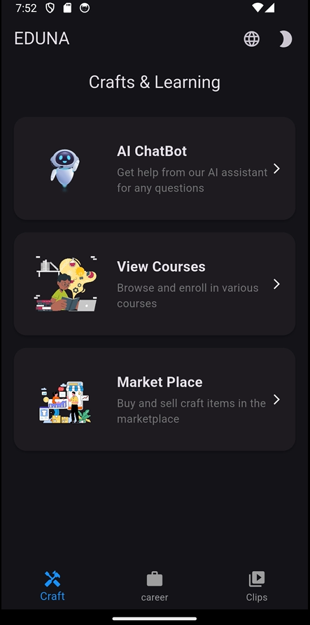
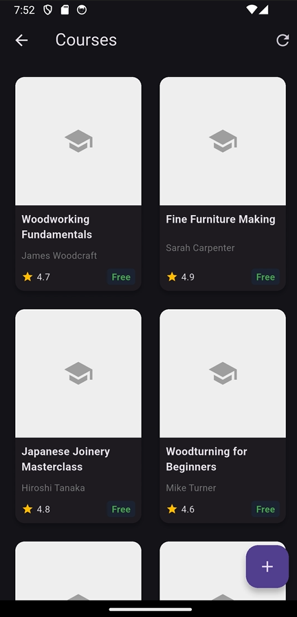

# EDUNA - AI-Powered Crafts E-Learning Platform


EDUNA is a comprehensive Flutter application that combines AI-powered learning, skill development, and marketplace features to create an engaging educational experience. The app supports multiple languages (English and Arabic) and features a responsive design that works on both mobile and web platforms.

## 🌟 Features

- **AI-Powered Learning**: Interactive learning experiences with AI assistance
- **Multi-language Support**: Seamless switching between English and Arabic
- **Dark/Light Mode**: Choose your preferred theme
- **Marketplace**: Buy and sell courses and crafts
- **Interactive UI**: Beautiful animations and responsive design
- **Cross-Platform**: Works on both mobile and web

## 🎥 Demo

[](https://youtube.com/shorts/QeMDQRsB2EQ)

*Click the image above to watch the demo video*

## 🖼️ Screens

### Onboarding Experience
| Onboarding 1 | Onboarding 2 | Onboarding 3 |
|--------------|--------------|--------------|
|  |  |  |
| Introduction to EDUNA | Explore Courses | Start Learning |

### Main Features
| Role Selection | Career Screen | Clips |
|----------------|----------------|--------|
|  |  |  |
| Choose your role | Career development | Short video clips |

### Marketplace & Learning
| Crafts | Courses | Marketplace |
|---------|----------|-------------|
|  |  |  |
| Handmade crafts | Learning courses | Full marketplace |

## 🚀 Getting Started

### Prerequisites

- Flutter SDK (latest stable version)
- Dart SDK (included with Flutter)
- Android Studio / VS Code with Flutter extensions
- Firebase account (for backend services)

### Installation

1. **Clone the repository**
   ```bash
   git clone https://github.com/yourusername/flutter_ai_chatbot.git
   cd flutter_ai_chatbot
   ```

2. **Install dependencies**
   ```bash
   flutter pub get
   ```

3. **Configure Firebase**
   - Create a new Firebase project at [Firebase Console](https://console.firebase.google.com/)
   - Add Android/iOS/Web app to your Firebase project
   - Download the configuration files and place them in the appropriate directories
   - Enable Authentication, Firestore, and Storage in your Firebase console

4. **Run the app**
   ```bash
   flutter run
   ```

## 🛠️ Tech Stack

- **Framework**: Flutter 3.x
- **State Management**: Provider, GetX
- **Backend**: Firebase (Authentication, Firestore, Storage)
- **Local Storage**: Hive
- **Animations**: Lottie, Flutter Animate
- **UI Components**: Material Design 3, Cupertino
- **Internationalization**: Flutter Intl

## 📂 Project Structure

```
lib/
├── assets/
│   ├── animations/    # Lottie animation files
│   └── images/        # App images and icons
├── helper/            # Helper classes and utilities
├── models/            # Data models
├── screens/           # App screens
├── services/          # Business logic and API services
├── widgets/           # Reusable widgets
├── main.dart          # App entry point
└── routes.dart        # App navigation routes
```

## 🔧 Configuration

### Environment Variables

Create a `.env` file in the root directory with the following variables:

```
FIREBASE_API_KEY=your_api_key
FIREBASE_AUTH_DOMAIN=your_auth_domain
FIREBASE_PROJECT_ID=your_project_id
FIREBASE_STORAGE_BUCKET=your_storage_bucket
FIREBASE_MESSAGING_SENDER_ID=your_messaging_sender_id
FIREBASE_APP_ID=your_app_id
```

### Build for Production

#### Android
```bash
flutter build apk --release
# or
flutter build appbundle
```

#### iOS
```bash
flutter build ios --release
```

#### Web
```bash
flutter build web --release
```

## 🤝 Contributing

Contributions are welcome! Please feel free to submit a Pull Request.

1. Fork the project
2. Create your feature branch (`git checkout -b feature/AmazingFeature`)
3. Commit your changes (`git commit -m 'Add some AmazingFeature'`)
4. Push to the branch (`git push origin feature/AmazingFeature`)
5. Open a Pull Request

## 📄 License

This project is licensed under the MIT License - see the [LICENSE](LICENSE) file for details.

## 🙏 Acknowledgments

- [Flutter](https://flutter.dev/)
- [Firebase](https://firebase.google.com/)
- [Lottie Files](https://lottiefiles.com/)
- All the amazing open-source packages this project depends on

---
</div>
